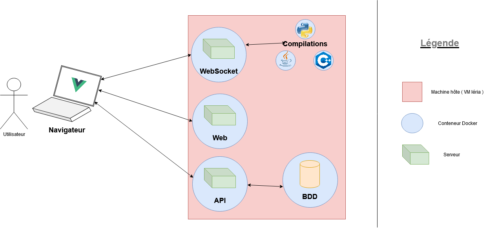

# Projet

Ce projet est un projet étudiants de l'université d'Angers. Il consiste en la réalisation d'une application en ligne de développement informatique, dédiée aux étudiants de licence pour pouvoir coder, compiler et exécuter des programmes depuis leur navigateur.

# Installation
## Prérequis
### Installer Docker
- [Docker Engine](https://docs.docker.com/engine/install/)
- [Docker Compose](https://docs.docker.com/compose/install/)

### Ouvrir l'API Docker
Il est nécéssaire d'avoir activé l'API Docker sur la machine, pour cela suivre ces consignes :
https://blog.usejournal.com/how-to-enable-docker-remote-api-on-docker-host-7b73bd3278c6 

## Configurer l'application
Vous pouvez modifier le fichier `.env` afin de changer les variables de configuration. Des valeurs par défaut sont déjà présentes.

>  **Important**: Les serveurs WebSocket, API(back) et Web doivent pouvoir être accessible depuis internet.  
>  **Important**: Choisir et modifier la clée privée JWT.

  
  
## Installation des sources
Installer ou lancer l'application en appelant le script `start_lide.sh` pour générer les images et déployer les services. Cette 

Lancez à nouveau le script avec l'option `-i` pour construire les images qui serviront pour les conteneurs d'éxécution (pour l'instant java, python et c++). Cette étape n'est plus nécéssaire ensuite pour relancer l'application.  

L'option `-f` permet de forcer la réinstallation du projet. Les images des serveurs sont rechargées, les volumes sont supprimés.  
> :warning: La base de données sera supprimée également. Faire un dump si nécéssaire avant ou récupérer les données dans le volume.  
  
L'option `-fl` permet de forcer la réinstallation du projet tout en préservant la base de données.  

## Portainer.io
- [portainer.io](https://www.portainer.io/)

Nous vous conseillons d'utiliser le service portainer.io pour superviser les services en production. Il permet de visualiser l'état des différents serveurs, les arrêter ou les lancer, obtenir leur logs ou prendre la main directement avec un terminal.  

Pour installer portainer.io sur la machine exécutez cette ligne de commande :  

`docker run -d -p PORT_ACESSIBLE_DEPUIS_INTERNET:9000 --name=portainer --restart=always -v /var/run/docker.sock:/var/run/docker.sock -v portainer_data:/data portainer/portainer-ce`

Le premier accès à l'interface nécéssitera de créer un compte administrateur qui sera utilisé pour les prochaines connexions.  

## Stopper l'application
Pour couper les services, executez la commande suivante : `docker-compose stop` à la racine du projet, ou bien avec portainer. Les données de la base persistent dans `/var/lib/docker/volumes/LIDE-APP_database`.

# Ajouter un nouveau langage
Pour que l'application prenne en compte un nouveau langage, il suffit de quelques étapes. Se rendre dans **lide-back/images** et d'ajouter les fichiers nécéssaires. Vous pouvez vous baser sur ceux déjà présents :   

- Faire un sous-dossier nommé par l'extension du type de fichier choisi, y inclure une image Docker basé sur le compilateur nécéssaire (cf. https://hub.docker.com/) et en entrypoint un script de compilation/execution.  

- Ajouter ce script. Se baser sur ceux déjà présents pour les autres langages  
>  **Important**: La première étape doit être le read socket. Le fichier à exécuter sera passé en argument, le récupérer avec $1.

- Modifier le script **build_images.sh** pour y ajouter la nouvelle image.

- Enfin, modifier le contrôleur d'exécution **lide-back/controllers/execution.controller.js** afin de prendre en compte la nouvelle extension de fichier.  

> Il sera peut-être nécéssaire de modifier l'IHM dans le serveur web pour prendre en compte la nouvelle extention, nottament dans la création de fichier.  
  

 # Architecture du projet
   
 
 # Technologies
 
 Le projet s'articule autour de plusieurs technologies. Voici les principales :  
 
  - ***Docker*** pour le déploiement et l'installation de l'application (https://docs.docker.com/) et la Docker API (https://docs.docker.com/engine/api/v1.41/)
  - ***Nodejs*** pour la création des différents serveurs (https://nodejs.org/en/)
  
  **Serveur web :** 
   - ***VueJS*** pour l'interface graphique de l'application (https://vuejs.org/) et son gestionnaire de store ***VueX*** (https://vuex.vuejs.org/)
   - ***Vuetify*** pour l'intégration de composants conçus pour VueJS (https://vuetifyjs.com/)
   - La bibliothèque ***CodeMirror*** pour l'éditeur de texte (https://codemirror.net/)
   - La bibliothèque ***Xtermjs*** pour le terminal IHM (https://xtermjs.org/)
   
   **Serveur API :** 
   - ***Expressjs*** pour la création des routes (https://expressjs.com/) 
   - ***JWT*** pour la sécurité de l'API, la gestion de token de session (https://jwt.io/introduction)
   - La bibliothèque ***child process*** js pour les commandes systèmes (https://nodejs.org/api/child_process.html)
   
   **Serveur WebSocket :**
   - ***WebSocket*** : (https://developer.mozilla.org/en-US/docs/Web/API/WebSocket)
   
   **Base de données :** 
   - ***MongoDB*** pour la base de données (https://www.mongodb.com/3)
   
   **Authentification :**
   - ***CAS*** Pour l'authentification au sein de l'université (https://apereo.github.io/cas/6.2.x/protocol/CAS-Protocol.html)
   
   
   

