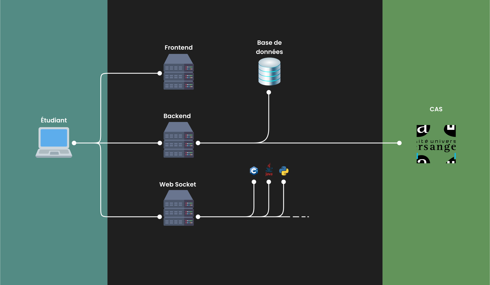

<div align="center" style="text-align: center;">
	<h1> LIDE </h1>

[](https://deepscan.io/dashboard#view=project&tid=17848&pid=21192&bid=600823)
</div>

Ce projet est issu d'un projet étudiants de l'Université d'Angers et repris par quelques étudiants pour le tutorat. Il consiste en une interface avec de multiple fonctionnalité de développement en ligne dans le navigateur, sans installation pour tous les étudiants et enseignants de l'université.

## Table des matières
 - [Installation 🛠️](#Installation)
 - [Utilisation 🚀](#Utilisation)
 - [Architecture ⚙️](#Architecture)
 - [Technologies 🧱](#Technologies)

## Installation

### 1️⃣ Installation de docker

Ce projet utilise docker et docker-compose, pour les installer :
| Dépendances | version minimum | version recommandé |
|-------------|-----------------|--------------------|
| [Docker Engine](https://docs.docker.com/engine/install/) | 20.0.0 | 20.10.14 |
| [Docker Compose](https://docs.docker.com/compose/install/) | 1.27.0 | 1.29.2 |


Ce projet utilise aussi l'API de docker, il faut donc l'activer, sous debian :
```bash
sudo sed -e -i "s/ExecStart\(.*\)/ExecStart\1 -H=tcp:\/\/0.0.0.0:2375 /g" /lib/systemd/system/docker.service
sudo shutdown -r now
```

### 2️⃣ Configuration de l'environnement

```bash
cp .env.example .env
mkdir HTTPS_CREDENTIALS
```

Vous devrez déposer dans le dossier HTTPS_CREDENTIALS un fichier `cert.pem` et `privkey.pem`
Qui sont deux fichier de certificat pour sécurisé par HTTPS les échanges.

Penser aussi à éditer le fichier `.env` pour l'ajuster à votre environnement.

### 3️⃣ Construction des images

```bash
docker-compose build
for container in $(find lide-back/images/ -maxdepth 1 -mindepth 1 -type d); do  docker build $container -t $( echo $container | cut -f 3 -d "/" )_lide ; done
```

## Utilisation

Pour lancer le projet vous pouvez simplement utiliser docker-compose :
```bash
# Lancement
docker-compose up -d
# Arrêt
docker-compose down
```

Le site sera ensuite disponible sur [https://localhost/](https://localhost/)

Assurez-vous que les ports utilisé par LIDE soit disponible sur votre machine.

_Par défaut il s'agit des ports 443,10000,10001_

## Architecture

   

## Technologies

 Le projet s'articule autour de plusieurs technologies. Voici les principales :  

  - ***Docker*** pour le déploiement et l'installation de l'application (https://docs.docker.com/) et la Docker API (https://docs.docker.com/engine/api/v1.41/)
  - ***Nodejs*** pour la création des différents serveurs (https://nodejs.org/en/)

  **Serveur web :**
   - ***VueJS*** pour l'interface graphique de l'application (https://vuejs.org/) et son gestionnaire de store ***VueX*** (https://vuex.vuejs.org/)
   - ***Vuetify*** pour l'intégration de composants conçus pour VueJS (https://vuetifyjs.com/)
   - La bibliothèque ***CodeMirror*** pour l'éditeur de texte (https://codemirror.net/)
   - La bibliothèque ***Xtermjs*** pour le terminal IHM (https://xtermjs.org/)

   **Serveur API :**
   - ***Expressjs*** pour la création des routes (https://expressjs.com/)
   - ***JWT*** pour la sécurité de l'API, la gestion de token de session (https://jwt.io/introduction)
   - La bibliothèque ***child process*** js pour les commandes systèmes (https://nodejs.org/api/child_process.html)

   **Serveur WebSocket :**
   - ***WebSocket*** : (https://developer.mozilla.org/en-US/docs/Web/API/WebSocket)

   **Base de données :**
   - ***MongoDB*** pour la base de données (https://www.mongodb.com/3)

   **Authentification :**
   - ***CAS*** Pour l'authentification au sein de l'université (https://apereo.github.io/cas/6.2.x/protocol/CAS-Protocol.html)
